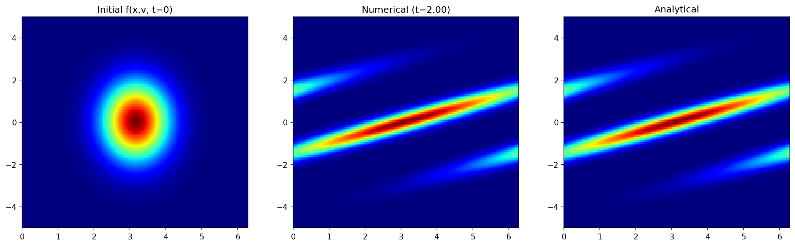

# Vlasov 1D-1V Simulation

This project implements a Vlasov 1D-1V solver using JAX/Kokkos/PyTorch. It simulates the evolution of a distribution function $f(x, v, t)$ in phase space.

## 1. Data Structures (JAX)

The simulation primarily uses JAX arrays (`jnp.ndarray`) for high-performance numerical operations. Similar data structures are used in Kokkos and PyTorch versions.

*   **`Grid`**: A frozen dataclass representing the 2D phase space grid.
    *   `x`: A 1D array of size `Nx` representing the spatial grid points in $[0, L]$ (periodic boundary condition).
    *   `v`: A 1D array of size `Nv` representing the velocity grid points in $[-V_{max}, V_{max}]$ (Dirichlet boundary condition).
*   **`Field`**: A dataclass holding the 1D field data (rho, phi).
    *   `rho`: Charge density of shape `(Nx)`.
    *   `phi`: Electric potential of shape `(Nx)`.
*   **`Variables`**: A dataclass holding the distribution function. 
    *   `fn`: 2D array of shape `(Nx, Nvx)` representing the distribution function.
    *   `f0`: 1D array of shape `(Nvx)` representing the equilibirum distribution function.
*   **`SimulationState`**: A dataclass encapsulating the full state of the simulation at a given time.
    *   Includes `grid`, `field`, `variables`, current time `t`, and step count `step`.

These classes are registered as JAX PyTree nodes, allowing them to be passed directly into JIT-compiled functions and `jax.lax.fori_loop`.

## 2. Simulation

The simulation solves the Vlasov equation using a time-splitting method:

1.  **Advection in X**: Advect $f$ along the spatial axis $x$ with velocity $v$ for a half time step ($\Delta t / 2$).
2.  **Advection in V**:
    *   Calculate the Electric Field $E(x)$ by solving Poisson's equation (if `PHYSICS_MODE` is enabled).
    *   Advect $f$ along the velocity axis $v$ with acceleration $E$ for a full time step ($\Delta t$).
3.  **Advection in X**: Advect $f$ along the spatial axis $x$ with velocity $v$ for another half time step ($\Delta t / 2$).

**Key Numerical Methods:**
*   **Advection**: A semi-Lagrangian scheme is used.
*   **Interpolation**: 5th-degree Lagrange interpolation (`lagrange_interp_5_uniform`) is used to estimate values at departure points.
*   **Poisson Solver**: A spectral solver using FFT (`solve_poisson`) computes the electric field from the charge density.

## 3. Kernels

* [JAX version](https://github.com/yasahi-hpc/JAX-PyTorch-Vlasov/blob/main/simulations/vlasov1d_1v/jax/src/vlasov1D1V.py). solver 0, 1 and 2 corresponds to baseline, roll, and gather-free versions.

```python
@partial(jax.jit, static_argnums=(5,))
def advect_1d_vectorized(
    f_batch: jnp.ndarray,
    velocities: jnp.ndarray,
    dt: float,
    dx: float,
    stencil_offsets: jnp.ndarray,
    periodic: bool = True
) -> jnp.ndarray:
    """Batched 1D advection using flat indexing

    Parameters
    ----------
    f_batch : jnp.ndarray
        Batch of distribution functions with shape ``(batch_size, n_points)``.
    velocities : jnp.ndarray
        Advection velocities with shape ``(batch_size,)`` or ``(batch_size, n_points)``.
    dt : float
        Time step size.
    dx : float
        Grid spacing in the advection direction.
    stencil_offsets : jnp.ndarray
        Interpolation stencil offsets with shape ``(6,)``.
    periodic : bool, optional
        Whether to apply periodic boundary conditions, by default True.

    Returns
    -------
    jnp.ndarray
        Advected distribution functions with shape ``(batch_size, n_points)``.

    Notes
    -----
    This routine never compute finite-difference derivatives.
    It evaluates

        f(x_i, t + dt) = f(x_i - v * dt, t)

    using higher-order Lagrange interpolation on the departure points.
    """
    batch_size, n_points = f_batch.shape
    grid_indices = jnp.arange(n_points, dtype=f_batch.dtype)

    # displacement in index units
    v_eff = velocities[:, None] if velocities.ndim == 1 else velocities
    displacement_idx = (v_eff * dt) / dx
    depart_idx = grid_indices[None, :] - displacement_idx

    idx_left = jnp.floor(depart_idx)
    alpha = depart_idx - idx_left
    idx_left = idx_left.astype(jnp.int32)

    stencil_indices = idx_left[:, :, None] + stencil_offsets[None, None, :]
    if periodic:
        stencil_indices = jnp.mod(stencil_indices, n_points)
        # Flat gather
        batch_ids = jnp.arange(batch_size)[:, None, None]
        flat_indices = batch_ids * n_points + stencil_indices
        f_vals = f_batch.ravel()[flat_indices.ravel()].reshape(batch_size, n_points, 6)
    else:
        valid_mask = (stencil_indices >= 0) & (stencil_indices < n_points)
        safe_indices = jnp.clip(stencil_indices, 0, n_points - 1)
        batch_ids = jnp.arange(batch_size)[:, None, None]
        flat_indices = batch_ids * n_points + safe_indices
        f_vals = f_batch.ravel()[flat_indices.ravel()].reshape(batch_size, n_points, 6)
        f_vals = jnp.where(valid_mask, f_vals, 0.0)

    return lagrange5_interp_sum(alpha, f_vals)
```

* [Kokkos version](https://github.com/yasahi-hpc/JAX-PyTorch-Vlasov/blob/main/simulations/vlasov1d_1v/kokkos/src/vlasov_poisson.hpp). solver 0 and 1 corresponds to TeamPolicy and MDRange versions.

```C++
MDRange2DType mdrange_policy(exec, {0, 0}, {fn.extent(0), fn.extent(1)});
std::string label = (axis == 0) ? "advect_x" : "advect_v";
Kokkos::parallel_for(
    label, mdrange_policy, KOKKOS_LAMBDA(const int ix, const int iv) {
      const int idx_batch  = axis == 0 ? iv : ix;
      const int idx_interp = axis == 0 ? ix : iv;
      auto sub_f = slice_f<axis>(fn, idx_batch);
      RealType departure_point =
          grid(idx_interp) - velocities(idx_batch) * dt;
      fnp1(ix, iv) =
          advect_1d_impl<axis>(sub_f, departure_point, nx, Lx, xmin, inv_dx);
    });
```

* [PyTorch version](https://github.com/yasahi-hpc/JAX-PyTorch-Vlasov/blob/main/simulations/vlasov1d_1v/pytorch/src/vlasov1D1V.py). solver 0, 1 and 2 corresponds to baseline, roll, and gather-free versions.

```python
@torch.compile
def advect_1d_vectorized(f_batch, velocities, dt, point_indices, batch_offsets, stencil_offsets, dx, periodic=True):
    """
    Vectorized 1D advection.
    f_batch: [Batch, Grid_Size] (The dimension to advect is the last one)
    velocities: [Batch] or [Batch, Grid_Size] (Speed at each point)
    """
    # Compute Departure Points: x_dep = x - v * dt
    # grid coords are 0, dx, 2dx... -> equivalent to indices 0, 1, 2...
    # We work in "index space" to save ops: idx_dep = idx - (v*dt)/dx
    batch_size, n_points = f_batch.shape

    # Calculate displacement in index units
    # Note: velocities can be scalar per batch (advect X) or vector (advect V with E(x))
    if velocities.ndim == 1:
        # velocities: [Batch] -> Broadcast to [Batch, N]
        velocities = velocities.unsqueeze(1)

    displacement_idx = (velocities * dt) / dx
    depart_idx = point_indices.unsqueeze(0) - displacement_idx

    # Floor and Fraction
    idx_left = torch.floor(depart_idx)
    alpha = depart_idx - idx_left # Fractional part [0, 1)
    idx_left = idx_left.to(torch.long)

    # Get stencil values and interpolate.
    # Flat indexing avoids creating [B, N, N] temporary tensors.
    stencil_indices = idx_left.unsqueeze(-1) + stencil_offsets

    f_batch = f_batch.reshape(-1)

    if periodic:
        safe_indices = torch.remainder(stencil_indices, n_points)
        gather_idx = (batch_offsets + safe_indices).reshape(-1)
        f_vals = f_batch[gather_idx].reshape(batch_size, n_points, 6)
    else:
        valid_mask = (stencil_indices >= 0) & (stencil_indices < n_points)
        safe_indices = torch.clamp(stencil_indices, 0, n_points - 1)
        gather_idx = (batch_offsets + safe_indices).reshape(-1)
        f_vals = f_batch[gather_idx].reshape(batch_size, n_points, 6)
        f_vals = f_vals * valid_mask.to(dtype=f_batch.dtype)

    f_new = lagrange5_interp_sum(alpha, f_vals)
    return f_new
```

## 4. Run and Simulation Results

Please run the following command.

```bash
# Kokkos (fp32, MDRange)
build/simulations/vlasov1d_1v/kokkos/src/vlp1d_1v_fp32 -nx 4096 -nv 4096 -nbiter 1000 -diag_steps 2000 -solver_type 1

# JAX (fp32, gather free)
cd simulations/vlasov1d_1v/jax/src
python vlasov1D1V.py -dtype float32 -nx 4096 -nv 4096 -nbiter 1000 -diag_steps 2000 -physics_mode -solver 2

# PyTorch (fp32, gather free)
cd simulations/vlasov1d_1v/pytorch/src
python vlasov1D1V.py -dtype float32 -nx 4096 -nv 4096 -nbiter 1000 -diag_steps 2000 -physics_mode -solver 2
```

The following figure shows the comparison between the initial condition, the numerical solution after time $t$, and the analytical solution (for the free-streaming case).



## 5. Timings

* After running the code, we have the output file `vlp1d_1v_H200_float32_N4096_solver2.txt` like this.

```
Jax version: 0.8.2
Starting simulation on NVIDIA GH200 120GB using float32 precision with Poisson solver and solver type vlasov_step_gather_free.
Grid: 4096x4096, Steps: 1000, chunks: 0, diag_freq: 2000
Running simulation without diagnostics (num_steps=0). Steps: 1000
Warming up JIT compilation...
JIT compilation done. Starting timed run...
Elapsed time: 0.6189801692962646 [s]

Memory statistics
Device memory before main loop : 192.20 MiB
Device memory after main loop  : 256.29 MiB
Device peak memory             : 320.37 MiB
Device memory limit            : 72960.00 MiB
Host peak RSS                  : 3509.69 MiB

Compiled memory analysis (per chunk, compiler-reported)
Argument size                  : 64.09 MiB
Output size                    : 64.09 MiB
Temp size                      : 64.06 MiB
Peak memory                    : 192.36 MiB
```
