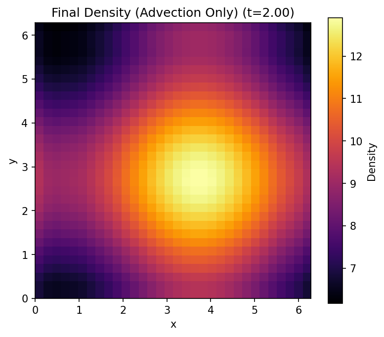

# Vlasov 2D-2V Simulation

This project implements a Vlasov 2D-2V solver using JAX. It simulates the evolution of a distribution function $f(t, x, y, v_x, v_y)$ in a 4D phase space.

## 1. Source Code

The main source code is located at: `src/vlasov2D-2V.py`

## 2. Data Structures

The simulation leverages JAX's PyTree system with custom dataclasses to manage the complex state:

*   **`Grid2D`**: A frozen dataclass representing the 4D phase space grid.
    *   Contains dimensions (`Nx`, `Ny`, `Nvx`, `Nvy`), physical lengths (`Lx`, `Ly`), and velocity bounds (`Vmax_x`, `Vmax_y`).
    *   Stores coordinate arrays for `x`, `y`, `vx`, and `vy`.
*   **`Field2D`**: A dataclass holding the 4D distribution function data.
    *   `data`: A JAX array of shape `(Nx, Ny, Nvx, Nvy)`.
*   **`SimState2D`**: A dataclass encapsulating the full state of the simulation at a given time.
    *   Includes `grid`, `field`, current time `t`, and step count `step`.

These classes are registered as JAX PyTree nodes, allowing them to be passed directly into JIT-compiled functions and `jax.lax.scan`.

## 3. Simulation

The simulation solves the Vlasov-Poisson system using a time-splitting method (Strang Splitting):

1.  **Drift (X, Y)**: Advect $f$ along spatial axes for $\Delta t / 2$.
    *   X-advection uses $v_x$.
    *   Y-advection uses $v_y$.
2.  **Kick (Vx, Vy)**:
    *   Calculate Electric Field $\mathbf{E} = (E_x, E_y)$ by solving the 2D Poisson equation.
    *   Advect $f$ along velocity axes for $\Delta t$ using acceleration $\mathbf{a} = \mathbf{E}$ (assuming $q/m=1$).
3.  **Drift (X, Y)**: Advect $f$ along spatial axes for another $\Delta t / 2$.

**Key Numerical Methods:**
*   **Dimensional Splitting**: The 4D advection is broken down into a sequence of 1D advections along each axis.
*   **Semi-Lagrangian Advection**: Uses 5th-degree Lagrange interpolation (`lagrange_interp_5_uniform`) to estimate values at departure points.
*   **Poisson Solver**: A spectral solver (`solve_poisson_2d`) uses 2D FFT to compute the electric field from the spatial charge density $\rho(x, y)$.

## 4. JIT Compilation (Just-In-Time)

JAX's JIT compilation is critical for performance in this high-dimensional problem:

*   **`advect_1d_core`**: The fundamental 1D advection kernel is JIT-compiled. It uses `jax.vmap` to parallelize interpolation across the orthogonal dimensions.
*   **`jax.lax.scan`**: The main simulation loop in `Vlasov2D.run` uses `scan` instead of a Python loop. This allows the XLA compiler to optimize the entire time-stepping sequence into a single fused operation, minimizing Python overhead and maximizing GPU/TPU utilization.
*   **PyTree Integration**: The custom data structures allow the entire state to be passed through these compiled boundaries seamlessly.

## 5. Simulation Results

The following figure shows the spatial density $\rho(x, y) = \int f dv_x dv_y$ of the simulation.



## 6. Timing

```
Jax version: 0.8.2
Starting simulation on NVIDIA GH200 120GB using float32 precision with Poisson solver and solver type vlasov_step_gather_free.
Grid: 128x128x128x128, Steps: 128, chunks: 0, diag_freq: 2000
Running simulation without diagnostics (num_steps=0). Steps: 128
Warming up JIT compilation...
JIT compilation done. Starting timed run...
Elapsed time: 1.2192354202270508 [s]

Memory statistics
Device memory before main loop : 3072.57 MiB
Device memory after main loop  : 4096.80 MiB
Device peak memory             : 6144.93 MiB
Device memory limit            : 72960.00 MiB
Host peak RSS                  : 6402.25 MiB

Compiled memory analysis (per chunk, compiler-reported)
Argument size                  : 1024.19 MiB
Output size                    : 1024.22 MiB
Temp size                      : 2048.06 MiB
Peak memory                    : 4096.57 MiB
```
